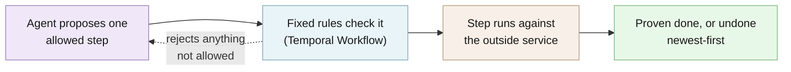

# Agentic Saga

Helps Python developers let an AI agent run multi-step jobs like checkout, and safely undo finished steps if one fails.

[](https://github.com/hseshadr/agentic-saga/actions/workflows/dagger.yml)
[](LICENSE)

[Docs](docs/temporal-safety-contract.md) · [Quickstart](QUICKSTART.md)

```text
input:  a checkout that reserves stock, charges the card, and books delivery,
        where the delivery company rejects the order after accepting it
output: Agent chose: reserve_inventory -> charge_payment -> schedule_fulfillment -> verify_order
        Undo order:  cancel_fulfillment -> refund_payment -> release_inventory
        Outcome:     compensated_verified
```
<sub>Real output of the example below (its one log line is shown there).</sub>

## At a glance

- **What it does** — Like a travel agent who books your flight, hotel, and car, and who, if the car falls through, cancels the hotel and refunds the flight in the right order. An AI agent (or plain code) picks the next step; fixed rules written in ordinary Python decide which steps are allowed, how each one is undone, and when to stop and ask a person. Progress is kept by Temporal (a service that records every step, so a crash or restart does not lose work).
- **Who it's for** — A Python developer building a checkout, booking, or account-setup flow that touches several outside services (stock, payments, delivery) who wants an AI agent to choose the steps without letting it decide refunds, retries, or when the job is done.
- **What stays on your device / what leaves it** — Stays: the example above runs entirely on your machine against simulated stores and a local test server; it needs no account or API key. Leaves: every step's inputs and results are written to the Temporal server you connect to (your own, or Temporal Cloud if you choose it). Only if you switch on the optional AI agent, the goal, the current public facts, and the list of allowed steps go to OpenRouter (a paid AI-model service), using your key. Nothing else is sent.
- **Runs on** — Python 3.12 or 3.13 on Linux or macOS, with [uv](https://docs.astral.sh/uv/). The example starts its own throwaway Temporal test server; real use needs a Temporal server (`temporal server start-dev` locally, or Temporal Cloud).
- **Not for** — Jobs that fit inside one database transaction (use the database). It also cannot make an outside service safe to retry if that service has no way to recognize a repeated request.
- **Status** — Beta: version 0.1.0 (pre-1.0), not yet released: no version tag has been pushed and nothing is on PyPI; the CHANGELOG has only an Unreleased section. See [CHANGELOG](CHANGELOG.md).

## Try it in 60 seconds

```bash
git clone https://github.com/hseshadr/agentic-saga.git && cd agentic-saga && uv sync --group dev
```

Save this as `try_saga.py` in the `agentic-saga` folder:

```python
import asyncio

from examples.ecommerce.demo import run_scenario

# A checkout: reserve stock, charge the card, book delivery.
# In this scenario the delivery company rejects the order after accepting it.
run = asyncio.run(run_scenario("business-failure"))

print("Agent chose:", " -> ".join(run.proposals))
print("Undo order: ", " -> ".join(run.compensation_order))
print("Outcome:    ", run.state.status.value)
```

Run it with `uv run python try_saga.py`. Real output:

```text
2026-09-23T16:46:07.756383Z  WARN temporalio_sdk_core::worker: Temporal Server 1.16.0 or newer is required to guarantee that the latest heartbeat details are preserved when an activity fails; the server did not advertise the activity_failure_include_heartbeat capability, so heartbeat details may be lost on failure
Agent chose: reserve_inventory -> charge_payment -> schedule_fulfillment -> verify_order
Undo order:  cancel_fulfillment -> refund_payment -> release_inventory
Outcome:     compensated_verified
```

The agent walked forward through the checkout; the check at the end failed, so the rules undid the
three finished steps newest-first and proved the result. The `WARN` line comes from Temporal's
local test server and does not affect the outcome. Change `"business-failure"` to `"happy-path"`
and the outcome becomes `succeeded_verified` with no undo steps. The first run also downloads
Temporal's test-server program once, so it can take longer than a minute; later runs take a few
seconds.

More runnable examples: [`examples/`](examples/).

## How it works

Your application registers its steps as typed tools, and pairs each step that changes something
with the step that undoes it. On every turn the agent sees the goal, the current public facts, and
only the tools that are allowed right now, and proposes one. A deterministic Temporal Workflow
checks that proposal, runs it, and records the result; if a response is lost it asks the provider
what actually happened before doing anything else. When the job cannot be proven complete, the
Workflow undoes every confirmed step in reverse order, and stops for an authorized person only if
it still cannot prove a safe result.



**[Explore the interactive architecture map →](docs/architecture/index.html)**
(Archify, generated from [`docs/architecture/agentic-saga.architecture.json`](docs/architecture/agentic-saga.architecture.json)).
Deep dive: [docs/temporal-safety-contract.md](docs/temporal-safety-contract.md).

### What is a Saga?

Suppose checkout must reserve stock, charge a card, and schedule fulfillment. Those systems cannot
share one database transaction. A Saga treats each successful step as a fact and pairs it with an
undo action:

| Forward action | Compensation if a later step fails |
| --- | --- |
| Reserve inventory | Release inventory |
| Charge payment | Refund payment |
| Schedule fulfillment | Cancel fulfillment |

If fulfillment fails after the first two actions succeeded, the Saga compensates the confirmed
effects in safe reverse order. If a provider response is lost, it first reconciles with that
provider instead of guessing or repeating the effect blindly.

### Why make the orchestrator agentic?

A static orchestrator accumulates branches for alternate suppliers, stale facts, partial progress,
retries, and every new exception. An agent can inspect fresh public evidence and choose the best
currently eligible capability without encoding every route as nested `if/else` logic.

The agent is the smart orchestrator. It is not the transaction authority. The model does **not**
receive unrestricted functions. On each turn it sees a small, typed set of eligible tools. Temporal
then validates and executes the proposal using deterministic rules.

```text
public goal + current evidence + eligible tools
                       |
                       v
              bounded agent decision
                       |
                       v
        deterministic Temporal Workflow validates
              /                    \
     business Activity       reject invalid proposal
              |
      receipt or reconciliation
              |
      prove success, continue, or compensate
```

No probability model or Markov decision process is required. The LLM only needs to choose a tool
and produce arguments within a constrained schema. The hard transaction guarantees remain ordinary,
testable code.

### The ecommerce example

The example is one application of the generic library, not a workflow baked into Agentic Saga.

```text
reserve inventory -> charge payment -> schedule fulfillment -> verify order
                                                              |
                              +-------------------------------+------------------+
                              |                                                  |
                       verified success                                   proof fails
                              |                                                  |
                   SUCCEEDED_VERIFIED                          cancel -> refund -> release
                                                                                 |
                                                                    COMPENSATED_VERIFIED
```

The agent chooses among forward tools. It never chooses rollback order. The Workflow derives that
order from confirmed effects and registered compensation pairs. A human enters only when automatic
reconciliation or compensation cannot prove a safe result. Human resolutions are authenticated by
an application-owned verification Activity before the Workflow accepts them.

The executable behavior includes four scenarios:

- verified happy path;
- fulfillment rejection with automatic `cancel -> refund -> release`;
- lost payment response recovered by stable-ID reconciliation without a duplicate charge; and
- unresolved refund compensation that pauses for a verified human resolution.

### The Lego model

Agentic Saga deliberately does not reimplement a durable workflow engine.

| Lego | Responsibility |
| --- | --- |
| Temporal | Durable history, crash recovery, Activity retries, timers, Queries, and Updates |
| Agentic Saga Workflow | Eligibility, prerequisites, global budgets, proof gates, reverse compensation, escalation |
| Pydantic AI | OpenRouter-backed native tool choice from bounded public context |
| Jev adapter | Optional probability-bearing choice among application-built candidates |
| Your integrations | Typed provider calls, idempotency, authorization, reconciliation, receipts |
| Flight Recorder | Redacted, read-only explanation of the recorded execution |

This keeps the library focused on the seam between probabilistic planning and deterministic
transaction safety.

### Source map

| Surface | Responsibility |
| --- | --- |
| `src/agentic_saga/temporal/` | Workflow, Activities, typed client/Worker helpers, journal, trace projection |
| `src/agentic_saga/contracts/` | Strict serializable values and public payload limits |
| `src/agentic_saga/agents/` | Pydantic AI, Jev, and OpenRouter decision adapters |
| `src/agentic_saga/manifest.py` | Bounded domain-neutral context manifests |
| `examples/ecommerce/` | Realistic provider, Worker, scenarios, BDD features, and evaluation |
| `web/flight-recorder/` | Accessible animated trace explorer |

## What you can do

- Run a multi-step job where an agent picks each step and fixed rules enforce order, limits, and
  proof — [Temporal safety contract](docs/temporal-safety-contract.md)
- Undo confirmed steps automatically, newest-first, when a later step fails —
  [ecommerce example](examples/ecommerce/README.md)
- Recover from a lost response without charging twice, by asking the provider what happened —
  [operations guide](docs/operations.md)
- Pause for an authorized person when an undo cannot be proven, and reject stale or unauthorized
  decisions — [Temporal safety contract](docs/temporal-safety-contract.md)
- Describe the job's goal, allowed tools, and budgets to the agent in a `saga.yaml` file —
  [context-manifest guide](docs/context-manifest.md)
- Choose a deterministic driver, a Pydantic AI agent through OpenRouter, or Jev —
  [agent adapter guide](docs/agent-adapter.md)
- Replay a recorded run step by step in your browser — [Flight Recorder](docs/flight-recorder.md)

## Why this and not X

| Alternative | Better when | What Agentic Saga adds |
| --- | --- | --- |
| One database transaction | Every change lives in one database | Nothing — use the transaction |
| Temporal on its own | The route is fixed and easy to write as code | An agent that picks among allowed steps, with the undo order, limits, and proof checks already written |
| An agent framework calling tools directly | Nothing irreversible happens (search, drafting) | The agent never runs a step, chooses rollback order, or declares success itself |
| A hand-written `if/else` orchestrator | Few routes, rarely changing | Fewer branches: new routes become new eligible tools, not new nested logic |

Temporal's [deployment guide](https://docs.temporal.io/production-deployment) covers what an
operated Temporal Service needs; this library does not replace that.

## Security and trust model

- **Verified:** every agent proposal is re-checked by the Workflow against the currently allowed
  tools, prerequisites, per-tool call limits, and global budgets. Success requires fresh proof from
  an authoritative read. A human decision is accepted only after your application's verification
  Activity authenticates its opaque authorization reference and it matches the current event and
  operation.
- **Refuses rather than warns:** a proposal outside the allowed set is rejected; a lost response is
  reconciled before anything else happens; failed proof starts compensation; an undo that cannot be
  proven stops at `HUMAN_REQUIRED` instead of guessing; stale and unauthorized human Updates are
  rejected.
- **Not protected:** hostile Python installed in the Worker, outside services that cannot recognize
  a repeated request, private data placed in Temporal history without an encryption codec, and
  your organization's authorization policy. Traces and receipts are hash-checked but unsigned:
  anyone who can edit a trace file can rewrite it into another valid trace.
- **Verify a release:** no release is published yet. From a clean checkout of an exact commit,
  `uv run poe artifacts` and `uv run poe release-candidate` build one wheel and one source archive,
  check their SHA-256 digests in `SHA256SUMS`, and install and test them; see
  [PROVENANCE.md](PROVENANCE.md).

### What the library guarantees—and what it cannot

- Workflow decisions, prerequisites, budgets, compensation order, and terminal proof are
  deterministic and replayable.
- Activities are **at least once**. Every effect integration must use the stable operation identity
  for provider idempotency or fencing and implement authoritative reconciliation.
- A lost response is not success or failure. The Workflow reconciles it before continuing.
- `SUCCEEDED_VERIFIED` requires fresh proof. Failed proof starts compensation.
- Unresolved compensation stops at `HUMAN_REQUIRED`; it never guesses.
- A human Update is accepted only after an application-owned verification Activity authenticates
  its opaque authorization reference.

The library cannot create atomic commits across external services, make a non-idempotent provider
safe, contain hostile installed Python, or decide your organization's authorization policy.

Workflow inputs and history must be public/redacted under the default converter. Applications that
need private production payloads must configure a Temporal payload encryption codec backed by
their key-management system and enforce namespace access controls. Never place credentials in
`saga.yaml`, Workflow inputs, trace files, or receipts.

Read the [Temporal safety contract](docs/temporal-safety-contract.md),
[operations guide](docs/operations.md), and [security policy](SECURITY.md) before connecting real
providers.

See [SECURITY.md](SECURITY.md) for reporting a vulnerability.

## What this proves / what it does not prove

| Claim | Backed by |
| --- | --- |
| A failed checkout is undone newest-first, each step once | `tests/bdd/features/ecommerce_saga.feature` scenario "A fulfillment rejection reverses completed work"; the example above |
| A lost payment response does not charge twice | Same feature file, "A lost payment response does not charge twice" |
| An uncertain refund pauses for an authorized person; stale and unauthorized decisions are rejected | Same feature file, "An uncertain refund pauses for an authorized person" |
| Workflow logic is deterministic and covered | `uv run poe gate`: strict typing, Xenon grade A complexity, and at least 90% branch coverage on the core |
| The packaged wheel works from a clean commit | `uv run poe release-candidate`; see [PROVENANCE.md](PROVENANCE.md) |

Run the four scenarios in one command (it starts Temporal's isolated time-skipping test server):

```bash
uv run pytest -q -m temporal --force-enable-socket tests/bdd/steps/test_ecommerce_saga.py
```

**Not proven:** that any real payment, stock, or delivery provider is idempotent (the ecommerce
provider is a simulation, not a production commerce integration); the quality of any live model's
choices (model-quality evidence is not release-correctness evidence, and ordinary tests make no
model call); and behavior on a production Temporal Service (tests use the time-skipping test
server).

## Install

Agentic Saga is not published on PyPI. Install from source:

```bash
git clone https://github.com/hseshadr/agentic-saga.git
cd agentic-saga
uv sync --group dev                         # library + tests + example
uv sync --extra agent --group dev           # + Pydantic AI through OpenRouter
uv sync --extra jev --group dev             # + Jev (TypeSafe API)
uv sync --extra jev-openrouter --group dev  # + Jev through OpenRouter Decisions
```

Prerequisites: Python 3.12 or 3.13 on a POSIX system, and [uv](https://docs.astral.sh/uv/). For
manual development, install the [Temporal CLI](https://docs.temporal.io/cli) for
`temporal server start-dev`.

## Usage & API

### Watch a recorded run

The packaged Flight Recorder replays captured, redacted traces. It needs no API key or running
Temporal server:

```bash
uv run --no-dev agentic-saga demo --scenario business-failure --open
```

Choose **Watch from start**. The UI reveals the forward path and reverse compensation at a pace a
person can follow. All four scenarios are available in the same page; `--scenario` selects the
initial recording. The recorded outcome stays visible while you inspect earlier events.

These recordings use the deterministic checkout agent, without JEV or model calls. The recorder
is read-only. Its server stays open until Ctrl+C so you can inspect the results.
Open tabs check for updated recordings and UI builds automatically, with a visible freshness status.

### Run the real workflow locally

Start Temporal's single-binary development server:

```bash
uv sync --group dev
temporal server start-dev
```

In another terminal:

```bash
uv run python -m examples.ecommerce.run happy-path
uv run python -m examples.ecommerce.run business-failure
uv run python -m examples.ecommerce.run lost-response
uv run python -m examples.ecommerce.run compensation-failure
```

To execute all four scenarios and open their fresh results in the Flight Recorder:

```bash
uv run python -m examples.ecommerce.run all --open
```

`temporal server start-dev` is convenient local infrastructure, not a production topology. The
test suite uses Temporal's time-skipping test server. Production applications should connect the
same Worker and client code to Temporal Cloud or an operated Temporal Service.

See [QUICKSTART.md](QUICKSTART.md) for the complete copy-paste path.

### Minimal integration shape

An application supplies a typed `ToolRegistry`, an `AgentDriver`, a bounded `ExecutionBudget`, and
an authenticated human-resolution Activity. Agentic Saga supplies the Temporal Activities,
Workflow, client helpers, and Worker assembly.

```python
activities = TemporalActivities(agent, registry, budget)
worker = build_worker(
    client,
    task_queue="orders",
    activities=activities,
    human_resolution_activity=verify_operator_resolution,
)

handle = await start_saga(client, workflow_input, task_queue="orders")
result = await handle.result()
```

See [`examples/ecommerce`](examples/ecommerce) for complete tool definitions, provider-side
idempotency, reconciliation, a Worker, and all four outcomes.

### Describe intent with `saga.yaml`

`saga.yaml` is an agent context template, not an executable workflow language. It explains the
public objective, use cases, available capability names, safety guidance, and decision budgets.
Your application still registers the real typed tools in Python.

```yaml
schema_version: "1.0"
name: ecommerce-checkout
version: "1.0"
objective: Complete an order safely or compensate every confirmed effect.
instructions:
  - Choose one eligible forward tool from fresh public evidence.
success_criteria:
  - Authoritative proof confirms the completed order.
autonomy:
  mode: guarded
  instructions:
    - Never guess when a provider outcome is unknown.
budgets:
  turn_limit: 8
  tool_call_limit: 6
  elapsed_ms_limit: 60000
  token_limit: 4000
tools:
  catalog_sha256: "<digest of the registered descriptors>"
  allowed:
    - reserve_inventory
    - charge_payment
    - schedule_fulfillment
    - verify_order
checks: # declared labels for agent context; not evaluated by the runtime
  policy: []
  success: [order_verified]
  compensation: [effects_compensated]
  clean_abort: [no_external_effects]
escalation:
  conditions:
    - Compensation remains unresolved after safe retries and reconciliation.
  instructions:
    - Present redacted evidence to an authorized operator.
```

Compensation tools are registered with their forward effects; they are not offered to the agent as
forward choices. The Workflow invokes them when recovery is required. The same manifest shape can
describe ticket booking, travel reservations, provisioning, or any other Saga.

`checks` names are validated against the inventories you register, then passed to the agent as
context; nothing evaluates them. The enforced gates live on each `WorkflowTool`
(`proof_for_success`, `required_for_success`, `prerequisites`, `max_calls`) and in the Workflow
(global budgets, proof freshness, and the finish gate).

Read [the context-manifest guide](docs/context-manifest.md).

### Choose a decision adapter

**Deterministic driver.** Start here. The included deterministic driver exercises the real
Temporal Workflow and is the fastest way to prove provider semantics, compensation, and recovery
without an LLM.

**Pydantic AI through OpenRouter.** Pydantic AI supplies the model/tool loop as a bare `Agent` with
no built-in tools. Agentic Saga advertises only current native proposal tools as deferred schemas,
sets temperature to zero, and allows one bounded decision per Workflow turn. There is no
deep-agent framework in the path: a Saga decision is a single tool choice, not an autonomous
multi-step run.

```bash
uv sync --extra agent --group dev
cp .env.example .env
# Add OPENROUTER_API_KEY to .env, then explicitly opt in to a live evaluation.
```

Ordinary tests and release gates never make a paid model call. Read
[the agent adapter guide](docs/agent-adapter.md) for the opt-in command and data boundary.

**Jev.** Use Jev when the application can build a closed set of valid candidates and wants a
compact decision engine to rank them. The adapter preserves the returned probabilities and
confidence; Jev cannot invent arguments or execute an effect.

```bash
uv sync --extra jev --group dev             # TypeSafe API
uv sync --extra jev-openrouter --group dev  # OpenRouter Decisions API
```

## Configuration

Settings are read by your application, never implicitly by the library. The template
[`.env.example`](.env.example) contains no secret; copy it to `.env` (ignored by Git) and keep it
local.

| Name | Default | What it changes |
| --- | --- | --- |
| `OPENROUTER_API_KEY` | empty | Key for the optional Pydantic AI agent and OpenRouter Decisions |
| `TYPESAFE_API_KEY` | empty | Key for the direct TypeSafe AI Jev route |
| `RUN_LIVE_MODEL_EVALS` | `0` | Explicit consent for paid live-model evaluations |
| `TEMPORAL_ADDRESS` | `localhost:7233` | Local Temporal development endpoint |
| `TEMPORAL_NAMESPACE` | `default` | Local Temporal namespace |

For Temporal Cloud, use `TemporalCloudConfig` with `connect_cloud_client`; its API key is a masked
`SecretStr`. Per-job limits (turns, tool calls, elapsed time, tokens) live in `ExecutionBudget` and
the `saga.yaml` budgets. Never send a key through Temporal payloads.

## Limitations & roadmap

**Shipped:** nothing is in a tagged release yet. On `main` today: the Temporal Workflow and
Activities, reverse compensation, lost-response reconciliation, verified human recovery, the
deterministic, Pydantic AI, and Jev decision adapters, `saga.yaml` manifests, the Flight Recorder,
and the four-scenario ecommerce example. See [CHANGELOG.md](CHANGELOG.md).

**Planned (not shipped):** a first tagged release and PyPI package, which require a fresh
exact-commit gate and an explicit publish decision (see [PROVENANCE.md](PROVENANCE.md)).
`TerminalRequirement`, `HumanDecision`, `AuthorizedToolCall`, and
`ToolDescriptor.policy_constraints` are reserved and not enforced. Signed traces and receipts are
not implemented. Known operational limits are listed in the
[operations guide](docs/operations.md#known-limits).

## Getting help

- **GitHub Issues** — Best for: bugs and concrete feature requests.
- **Email (private)** — Best for: security reports; see [SECURITY.md](SECURITY.md).

## Contributing / development

```bash
uv run poe gate
```

`poe gate` runs Python formatting, lint, strict typing, complexity, offline tests, Temporal
time-skipping tests, coverage, and release-contract unit tests. The Flight Recorder has its own
pinned gate:

```bash
cd web/flight-recorder
npx --yes pnpm@11.5.0 install --frozen-lockfile
npx --yes pnpm@11.5.0 gate
cd ../..

# After committing, from a clean exact source tree:
uv run poe artifacts
uv run poe release-candidate
```

The pinned `pnpm` gate proves the recorder's tests, accessibility, build, packaged-asset parity,
and browser behavior. The final two commands build and install the package from a clean exact
commit. Core branch coverage must stay at or above 90%. Hosted CI runs all of these again through
Dagger from clean, exact source.

No release command publishes to PyPI. This repository does not claim a released package until a
fresh exact-commit gate and an explicit publish decision exist. See [PROVENANCE.md](PROVENANCE.md).

See [CONTRIBUTING.md](CONTRIBUTING.md).

## License / Citation

Apache-2.0 — see [LICENSE](LICENSE). Bundled frontend dependencies and notices are listed in
[THIRD_PARTY_NOTICES.md](THIRD_PARTY_NOTICES.md). To cite this project, use
[CITATION.cff](CITATION.cff).
