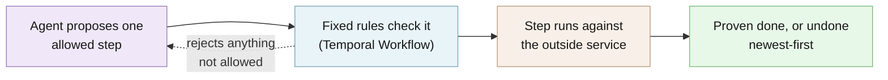

# Architecture

TL;DR: an agent (an AI model or plain code) proposes one allowed step at a time. A Temporal
Workflow (deterministic code that Temporal records and replays) checks the proposal, runs the step,
and owns everything that must not be left to a model: retries, undo order, limits, proof that the
job finished, and when to stop and ask a person.

This page holds the technical detail that used to live in the README. For the exact rules see the
[Temporal safety contract](temporal-safety-contract.md); for running it see
[operations](operations.md).

**[Explore the interactive architecture map](architecture/index.html)** (Archify, generated from
[`architecture/runtime.architecture.json`](architecture/runtime.architecture.json)).

## The flow



Your application registers its steps as typed tools, and pairs each step that changes something
with the step that undoes it. On every turn the agent sees the goal, the current public facts, and
only the tools that are allowed right now, and proposes one. The Workflow checks that proposal,
runs it, and records the result; if a response is lost it asks the provider what actually happened
before doing anything else. When the job cannot be proven complete, the Workflow undoes every
confirmed step in reverse order, and stops for an authorized person only if it still cannot prove
a safe result.

## What is a Saga?

Suppose checkout must reserve stock, charge a card, and schedule fulfillment. Those systems cannot
share one database transaction. A Saga treats each successful step as a fact and pairs it with an
undo action (a "compensation"):

| Forward action | Compensation if a later step fails |
| --- | --- |
| Reserve inventory | Release inventory |
| Charge payment | Refund payment |
| Schedule fulfillment | Cancel fulfillment |

If fulfillment fails after the first two actions succeeded, the Saga compensates the confirmed
effects in safe reverse order. If a provider response is lost, it first reconciles with that
provider instead of guessing or repeating the effect blindly.

## Why let an agent choose the steps?

A fixed orchestrator accumulates branches for alternate suppliers, stale facts, partial progress,
retries, and every new exception. An agent can look at fresh public facts and choose the best
currently allowed step without encoding every route as nested `if/else` logic.

The agent chooses; it is not in charge of the transaction. The model does not receive unrestricted
functions. On each turn it sees a small, typed set of eligible tools. Temporal then validates and
executes the proposal using deterministic rules.

```text
public goal + current evidence + eligible tools
                       |
                       v
              bounded agent decision
                       |
                       v
        deterministic Temporal Workflow validates
              /                    \
     business Activity       reject invalid proposal
              |
      outcome record or reconciliation
              |
      prove success, continue, or compensate
```

No probability model or Markov decision process is required. The LLM only needs to choose a tool
and produce arguments within a constrained schema. The hard transaction guarantees remain ordinary,
testable code.

## The ecommerce example

The example is one application of the generic library, not a workflow baked into Agentic Saga.

```text
reserve inventory -> charge payment -> schedule fulfillment -> verify order
                                                              |
                              +-------------------------------+------------------+
                              |                                                  |
                       verified success                                   proof fails
                              |                                                  |
                   SUCCEEDED_VERIFIED                          cancel -> refund -> release
                                                                                 |
                                                                    COMPENSATED_VERIFIED
```

The agent chooses among forward tools. It never chooses rollback order. The Workflow derives that
order from confirmed effects and registered compensation pairs. A human enters only when automatic
reconciliation or compensation cannot prove a safe result. Human resolutions are authenticated by
an application-owned verification Activity before the Workflow accepts them.

The executable behavior includes four scenarios:

- verified happy path;
- fulfillment rejection with automatic `cancel -> refund -> release`;
- lost payment response recovered by stable-ID reconciliation without a duplicate charge; and
- unresolved refund compensation that pauses for a verified human resolution.

Run all four through Temporal's isolated time-skipping test server:

```bash
uv run pytest -q -m temporal --force-enable-socket tests/bdd/steps/test_ecommerce_saga.py
```

## Building blocks

Agentic Saga deliberately does not reimplement a durable workflow engine.

| Component | Responsibility |
| --- | --- |
| Temporal | Durable history, crash recovery, Activity retries, timers, Queries, and Updates |
| Agentic Saga Workflow | Eligibility, prerequisites, global budgets, proof checks, reverse compensation, escalation |
| Pydantic AI | OpenRouter-backed native tool choice from bounded public context |
| Jev adapter | Optional probability-bearing choice among application-built candidates |
| Your integrations | Typed provider calls, idempotency, authorization, reconciliation, outcome records |
| Flight Recorder | Redacted, read-only explanation of the recorded execution |

The library stays focused on the boundary between a model's choice and deterministic transaction
safety.

## Source map

| Path | Responsibility |
| --- | --- |
| `src/agentic_saga/temporal/` | Workflow, Activities, typed client/Worker helpers, journal, trace projection |
| `src/agentic_saga/contracts/` | Strict serializable values and public payload limits |
| `src/agentic_saga/agents/` | Pydantic AI, Jev, and OpenRouter decision adapters |
| `src/agentic_saga/manifest.py` | Bounded domain-neutral context manifests (`saga.yaml`) |
| `src/agentic_saga/cli/`, `src/agentic_saga/demo/` | The `agentic-saga demo` command and its local recorder server |
| `examples/ecommerce/` | Realistic provider, Worker, scenarios, and evaluation |
| `web/flight-recorder/` | Accessible animated trace explorer |

## Minimal integration shape

An application supplies a typed `ToolRegistry`, an `AgentDriver`, a bounded `ExecutionBudget`, and
an authenticated human-resolution Activity. Agentic Saga supplies the Temporal Activities,
Workflow, client helpers, and Worker assembly.

```python
activities = TemporalActivities(agent, registry, budget)
worker = build_worker(
    client,
    task_queue="orders",
    activities=activities,
    human_resolution_activity=verify_operator_resolution,
)

handle = await start_saga(client, workflow_input, task_queue="orders")
result = await handle.result()
```

See [`examples/ecommerce`](../examples/ecommerce) for complete tool definitions, provider-side
idempotency, reconciliation, a Worker, and all four outcomes.

## Describe intent with `saga.yaml`

`saga.yaml` is an agent context template, not an executable workflow language. It explains the
public objective, use cases, available capability names, safety guidance, and decision budgets.
Your application still registers the real typed tools in Python.

```yaml
schema_version: "1.0"
name: ecommerce-checkout
version: "1.0"
objective: Complete an order safely or compensate every confirmed effect.
instructions:
  - Choose one eligible forward tool from fresh public evidence.
success_criteria:
  - Authoritative proof confirms the completed order.
autonomy:
  mode: guarded
  instructions:
    - Never guess when a provider outcome is unknown.
budgets:
  turn_limit: 8
  tool_call_limit: 6
  elapsed_ms_limit: 60000
  token_limit: 4000
tools:
  catalog_sha256: "<digest of the registered descriptors>"
  allowed:
    - reserve_inventory
    - charge_payment
    - schedule_fulfillment
    - verify_order
checks: # declared labels for agent context; not evaluated by the runtime
  policy: []
  success: [order_verified]
  compensation: [effects_compensated]
  clean_abort: [no_external_effects]
escalation:
  conditions:
    - Compensation remains unresolved after safe retries and reconciliation.
  instructions:
    - Present redacted evidence to an authorized operator.
```

Compensation tools are registered with their forward effects; they are not offered to the agent as
forward choices. The Workflow invokes them when recovery is required. The same manifest shape can
describe ticket booking, travel reservations, provisioning, or any other Saga.

`checks` names are validated against the inventories you register, then passed to the agent as
context; nothing evaluates them. The enforced checks live on each `WorkflowTool`
(`proof_for_success`, `required_for_success`, `prerequisites`, `max_calls`) and in the Workflow
(global budgets, proof freshness, and the finish check).

Read [the context-manifest guide](context-manifest.md).

## Decision adapters

**Deterministic driver.** Start here. The included deterministic driver exercises the real
Temporal Workflow and is the fastest way to prove provider semantics, compensation, and recovery
without an LLM.

**Pydantic AI through OpenRouter.** Pydantic AI supplies the model/tool loop as a bare `Agent` with
no built-in tools. Agentic Saga advertises only current native proposal tools as deferred schemas,
sets temperature to zero, and allows one bounded decision per Workflow turn. A Saga decision is a
single tool choice, not an autonomous multi-step run.

```bash
uv sync --extra agent --group dev
cp .env.example .env
# Add OPENROUTER_API_KEY to .env, then explicitly opt in to a live evaluation.
```

Ordinary tests and release checks never make a paid model call. Read
[the agent adapter guide](agent-adapter.md) for the opt-in command and data boundary.

**Jev.** Use Jev when the application can build a closed set of valid candidates and wants a
compact decision engine to rank them. The adapter preserves the returned probabilities and
confidence; Jev cannot invent arguments or execute an effect.

```bash
uv sync --extra jev --group dev             # TypeSafe API
uv sync --extra jev-openrouter --group dev  # OpenRouter Decisions API
```

## Configuration

Settings are read by your application, never implicitly by the library. The template
[`.env.example`](../.env.example) contains no secret; copy it to `.env` (ignored by Git) and keep it
local.

| Name | Default | What it changes |
| --- | --- | --- |
| `OPENROUTER_API_KEY` | empty | Key for the optional Pydantic AI agent and OpenRouter Decisions |
| `TYPESAFE_API_KEY` | empty | Key for the direct TypeSafe AI Jev route |
| `RUN_LIVE_MODEL_EVALS` | `0` | Explicit consent for paid live-model evaluations |
| `TEMPORAL_ADDRESS` | `localhost:7233` | Local Temporal development endpoint |
| `TEMPORAL_NAMESPACE` | `default` | Local Temporal namespace |

For Temporal Cloud, use `TemporalCloudConfig` with `connect_cloud_client`; its API key is a masked
`SecretStr`. Per-job limits (turns, tool calls, elapsed time, tokens) live in `ExecutionBudget` and
the `saga.yaml` budgets. Never send a key through Temporal payloads.

## Data: what stays local and what leaves

The ecommerce example runs entirely on your machine against simulated stores and a local test
server; it needs no account or API key. In real use, every step's inputs and results are written to
the Temporal server you connect to (your own, or Temporal Cloud). Only if you switch on the
optional AI agent, the goal, the current public facts, and the list of allowed steps go to
OpenRouter (a paid AI-model service), using your key. Nothing else is sent.

## Security model

- **Checked:** every agent proposal is re-checked by the Workflow against the currently allowed
  tools, prerequisites, per-tool call limits, and global budgets. Success requires fresh proof from
  an authoritative read. A human decision is accepted only after your application's verification
  Activity authenticates its opaque authorization reference and it matches the current event and
  operation.
- **Refuses rather than warns:** a proposal outside the allowed set is rejected; a lost response is
  reconciled before anything else happens; failed proof starts compensation; an undo that cannot be
  proven stops at `HUMAN_REQUIRED` instead of guessing; stale and unauthorized human Updates are
  rejected.
- **Not protected:** hostile Python installed in the Worker, outside services that cannot recognize
  a repeated request, private data placed in Temporal history without an encryption codec, and
  your organization's authorization policy. Traces and outcome records are hash-checked but
  unsigned: anyone who can edit a trace file can rewrite it into another valid trace.
- **Verify a release:** no release is published yet. From a clean checkout of an exact commit,
  `uv run poe artifacts` and `uv run poe release-candidate` build one wheel and one source archive,
  check their SHA-256 digests in `SHA256SUMS`, and install and test them; see
  [PROVENANCE.md](../PROVENANCE.md).

### What the library guarantees, and what it cannot

- Workflow decisions, prerequisites, budgets, compensation order, and terminal proof are
  deterministic and replayable.
- Activities are **at least once**. Every effect integration must use the stable operation identity
  for provider idempotency or fencing and implement authoritative reconciliation.
- A lost response is not success or failure. The Workflow reconciles it before continuing.
- `SUCCEEDED_VERIFIED` requires fresh proof. Failed proof starts compensation.
- Unresolved compensation stops at `HUMAN_REQUIRED`; it never guesses.
- A human Update is accepted only after an application-owned verification Activity authenticates
  its opaque authorization reference.

The library cannot create atomic commits across external services, make a non-idempotent provider
safe, contain hostile installed Python, or decide your organization's authorization policy.

Workflow inputs and history must be public/redacted under the default converter. Applications that
need private production payloads must configure a Temporal payload encryption codec backed by
their key-management system and enforce namespace access controls. Never place credentials in
`saga.yaml`, Workflow inputs, trace files, or outcome records.

Read the [Temporal safety contract](temporal-safety-contract.md),
[operations guide](operations.md), and [security policy](../SECURITY.md) before connecting real
providers.

## What the tests prove, and what they do not

| Claim | Backed by |
| --- | --- |
| A failed checkout is undone newest-first, each step once | `tests/bdd/features/ecommerce_saga.feature` scenario "A fulfillment rejection reverses completed work" |
| A lost payment response does not charge twice | Same feature file, "A lost payment response does not charge twice" |
| An uncertain refund pauses for an authorized person; stale and unauthorized decisions are rejected | Same feature file, "An uncertain refund pauses for an authorized person" |
| Workflow logic is deterministic and covered | `uv run poe gate`: strict typing, Xenon grade A complexity, and at least 90% branch coverage on the core |
| The packaged wheel works from a clean commit | `uv run poe release-candidate`; see [PROVENANCE.md](../PROVENANCE.md) |

**Not proven:** that any real payment, stock, or delivery provider is idempotent (the ecommerce
provider is a simulation, not a production commerce integration); the quality of any live model's
choices (model-quality evidence is not release-correctness evidence, and ordinary tests make no
model call); and behavior on a production Temporal Service (tests use the time-skipping test
server).

## Limitations and roadmap

**Shipped:** nothing is in a tagged release yet. On `main` today: the Temporal Workflow and
Activities, reverse compensation, lost-response reconciliation, verified human recovery, the
deterministic, Pydantic AI, and Jev decision adapters, `saga.yaml` manifests, the Flight Recorder,
and the four-scenario ecommerce example. See [CHANGELOG.md](../CHANGELOG.md).

**Planned (not shipped):** a first tagged release and PyPI package, which require a fresh
exact-commit check and an explicit publish decision (see [PROVENANCE.md](../PROVENANCE.md)).
`TerminalRequirement`, `HumanDecision`, `AuthorizedToolCall`, and
`ToolDescriptor.policy_constraints` are reserved and not enforced. Signed traces are not
implemented. Known operational limits are listed in the
[operations guide](operations.md#known-limits).

Temporal's [deployment guide](https://docs.temporal.io/production-deployment) covers what an
operated Temporal Service needs; this library does not replace that.
